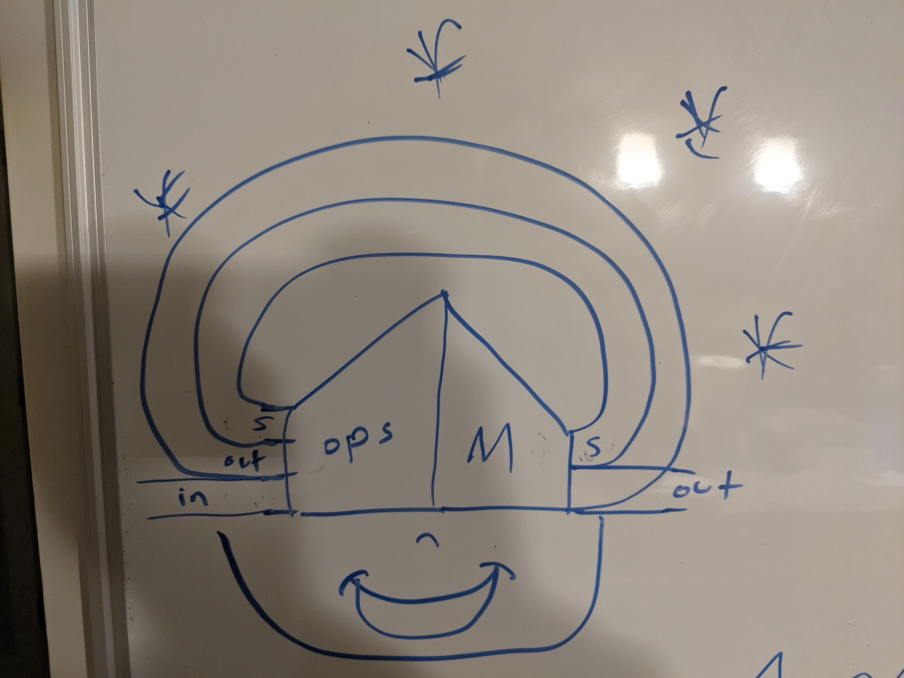

# Simple RNN

Messing around with compiling functions to single-layer RNNs.

They have a single matrix of weights `M :: (I ++ S ++ O) -> (S ++ O)`, where `S` is hidden a state vector and `I` and `O` are input/output vectors.

We can compile terms like `(int (d i))` to matrices. In this example, the output approximately integrates the derivative of the input, giving the input back with a delay. It produces the matrix:

```
   s1  s2  o
[[ 1.  1.  0.]  i
 [ 0. -1.  0.]  s1
 [ 0.  0.  1.]  s2
 [ 0.  0.  1.]] o
```

`s1` is `i` lagged by a time step.
`s2` is `i-s1`.
`o`  is `s2+o`.

So it's equivalent to the term `(+ (d i) o)` and therefore `(+ (- i (+ i)) o)`. Note `(+ i)` isn't redundant because it introduces a 1 step lag.

### Files

- `main.ipynb`: Very simple agents that can only do basic matrix stuff
    - the last example is a PID controller
- `main2.ipynb`: Adds unary functions like `log`, `exp`, etc.

### TODO

- support operations: 
    - we want `M :: (ISO ++ log(ISO) ++ exp(ISO) ++ ...) -> (S ++ O)`, where `ISO := (I ++ S ++ O)`
    - see diagram below
    - FIXME: this fails because 0 * inf == nan
- more forms in the compiled language
    - ex: `(* x y) := (exp (+ (log x) (log y)))`
- constants
- also produce an initial state vector
- optimize the compiled output
- program synthesis (backprop)
- pretty diagrams so it looks like its doing something

- use square `(I ++ S ++ O) -> (I ++ S ++ O)` matrices and use composition
    - this could speed up very simple agents, but doesn't work for full agents





